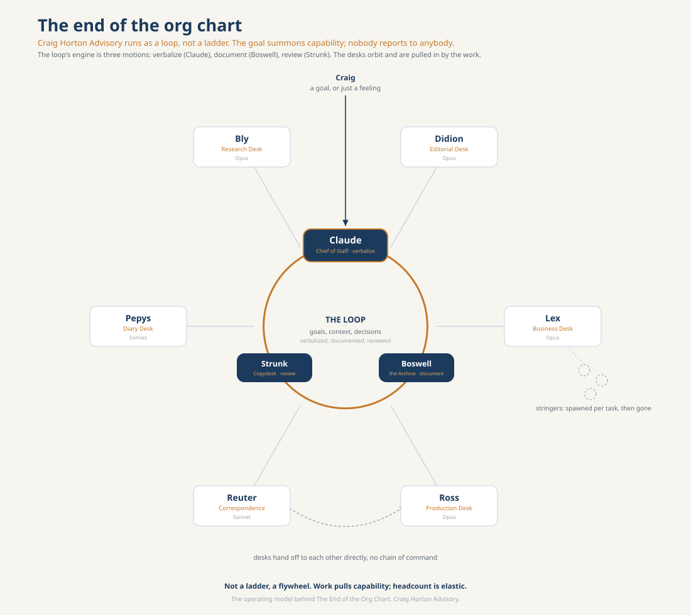

# The Newsroom: The Compounding Firm Run At Personal Scale

By Craig Horton, Craig Horton Advisory.

## Why this doc exists

The rest of this package proves the Compounding Firm thesis at the firm level: a
portable Veteran Capital artifact, a private-eval reward that climbs, and a moat
that survives a base-model swap. This doc shows the same thesis run at personal
scale, on me, as the operating model behind Craig Horton Advisory. It is also the
visual that goes with The End of the Org Chart.

Same loop, smaller blast radius. If it works for a person, it scales.

## The picture

Not a ladder. A flywheel. The goals-context-decisions loop is the centre of
gravity. Three motions turn it: verbalize (Claude), document (Boswell), review
(Strunk). Six desks orbit as peer capability that the work pulls in. Headcount is
elastic: stringers spawn for a task and vanish. Nobody reports to anybody.

## The cast

| Role on the loop | Agent | Job | Model |
|---|---|---|---|
| Chief of Staff (verbalize) | Claude | Turn a vague or stressed ask into a named sweep; assign the desks. | Opus |
| the Archive (document) | Boswell | Write every goal, context, and decision to the GCD ledger in Notion. | Haiku |
| Copydesk (review) | Strunk | Pass, Fix, or Escalate against the house standard. Flags only exceptions. | Sonnet |
| Editorial Desk | Didion | Thought leadership and The Transformation Brief. | Opus |
| Business Desk | Lex | Advisory pipeline and roles. Never sends; human gate. | Opus |
| Production Desk | Ross | Client documents, workshops, deliverables. | Opus |
| Correspondence Desk | Reuter | Inbox and Slack. Drafts only. | Sonnet |
| Diary Desk | Pepys | The calendar. A brief for every meeting. | Sonnet |
| Research Desk | Bly | The daily scan and sources. | Opus |

Naming principle: each is a real figure from journalism or letters, picked so the
name is the job. The masthead is original to Craig Horton Advisory.

## How the loop turns

A goal enters the loop, or a feeling that Claude reads as a brief. Claude
verbalizes it, fans out to whichever desks the goal pulls in, and clears what can
be cleared. Boswell logs every goal, context, and decision to the ledger. Strunk
reviews work and decisions against the house standard. Reviewed decisions feed
back to everyone, so the next cycle needs less of Craig. That is the compounding
mechanism, applied to a working week instead of a firm's books.

## The connection to the framework

Same flywheel, three scales.

- At the model: the learned calibration policy refits each iteration. Hill-climb.
- At the firm: the Veteran Capital artifact accumulates institutional memory. The
  Veteran Test and the moat.
- At the person: the GCD ledger accumulates reviewed decisions and house judgment.
  This doc.

Every reviewed Pass in the ledger is a trace the firm owns. Over time, the ledger
*is* Craig Horton Advisory's Veteran Capital. The newsroom is not analogous to the
Compounding Firm thesis. It is the thesis, running at personal scale.

## Where it lives

- Agent definitions (drop-in): `~/.claude/agents/{claude,didion,lex,ross,reuter,pepys,bly,strunk,boswell}.md`
- Skills: `~/.claude/skills/{standup,sweep}/SKILL.md`
- Ledger: Notion, in the Transformation Brief hub, under Boswell — the Archive.

## Provenance

The thesis is Satya Nadella's: human capital and token capital compounding inside
a firm-owned learning loop, and a frontier ecosystem rather than just a frontier
model. The newsroom is the operating model that runs it.
